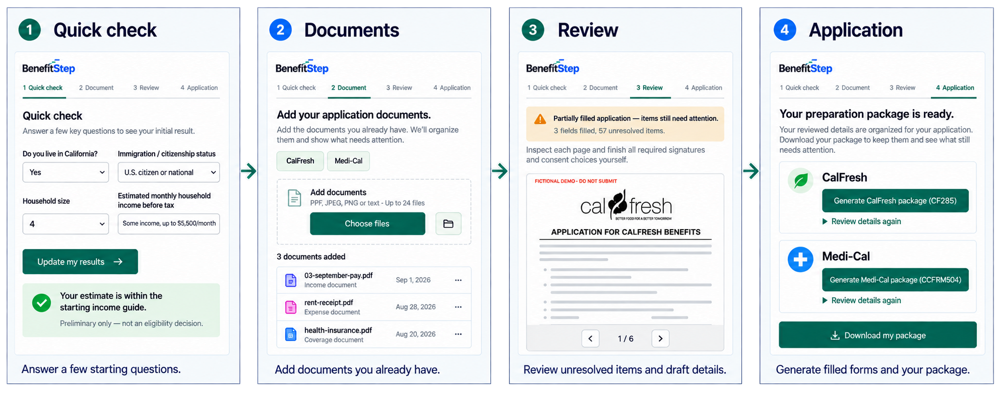

# BenefitStep

Prepare your benefits application package with a quick check, document review and downloadable application drafts.

*Workflow illustration; some screen details may differ from the current preview. Official PDF preview opens during the Application step.*

## How to use BenefitStep

1. **Quick check:** Start CalFresh, Medi-Cal or both and answer the initial questions. You can continue to Documents without starting the other program. Results are preliminary, not eligibility decisions.
2. **Documents:** Add the files or folder you already have—for example, pay stubs, rent receipts, utility bills or health insurance information. Or select **Try example documents** to explore with fictional data. Click the details-to-review link to see the extracted names, dates and amounts.
3. **Review:** Check the items needing attention, then verify the details needing confirmation against their sources. Edit anything incorrect and click **Confirm reviewed details**. Changing reviewed information requires confirmation again before package generation.
4. **Application:** Choose **Generate CalFresh package (CF285)** or **Generate Medi-Cal package (CCFRM604)** for a program you started. Review and confirm the application answers, preview the unsigned PDF, and download your application package. Expand **Review details again** whenever you need to check the prepared answers.

**Download before closing or reloading.** Your work is temporary. Downloaded drafts may still have unresolved items; complete missing answers and signatures before submitting through the official application process. BenefitStep does not submit for you. Never submit fictional example documents.

The `extension/` directory contains the current **multilingual and household-review development preview**. The archived **v0.3.2 Chrome Web Store submission candidate** and its publication materials remain in `releases/`. Development tools and training data are maintained separately.

## Install locally

1. Download or clone this repository.
2. Open `chrome://extensions` in desktop Chrome 138 or later.
3. Enable **Developer mode**, select **Load unpacked**, and choose the [`extension/`](extension/) directory.
4. Pin BenefitStep and open its side panel.

No build command, Node.js, Python, server or account is required. For the archived v0.3.2 candidate, unzip the [extension release ZIP](releases/chrome-store-0.3.2/benefitstep-0.3.2-chrome-store.zip) and load its extracted folder.

## Multilingual and household-review preview

Use **Language / 语言** to switch between English, Spanish and Simplified Chinese. Draft translations cover the main workflow; some detailed explanations and official PDFs remain English.

In Documents or Review, choose **Enter household details** to enter your name, California address and household members. Source checks compare recipient names, recipient/service addresses and dates before using financial details. Records outside the adjustable recent-document window (initially 90 days) are unusable for current preparation. This window is a local preparation setting, not an agency acceptance rule. Source corrections preserve original documents. Saving your own household removes explicitly marked fictional demo sources and questionnaire answers.

Try the fictional [Alex Demo test pack](demo/test_example2/README.md), importing only its `pdfs/` folder. Image values still need visual confirmation; GIFs use the first frame only. See [coverage and limitations](MULTILINGUAL_INTEGRATION.md).

Validation: the development suite passed 277 tests. Offline installed-extension checks passed for household entry, stale-amount exclusion, source correction, Spanish/Chinese switching and all four Alex PDFs (57 confirmed facts, zero evidence-check findings). The five earlier sample images decoded successfully; native image-model extraction quality was not measured. The 71 targeted Node checks in `tests/` also passed against this repository layout; browser checks need desktop Chrome and Python 3.

## Chrome Web Store submission

Upload only **[benefitstep-0.3.2-chrome-store.zip](releases/chrome-store-0.3.2/benefitstep-0.3.2-chrome-store.zip)** as the extension package.

The [store materials](releases/chrome-store-0.3.2/store-assets/) include screenshots, icons, promotional images, listing text, the privacy policy and reviewer instructions. Follow the [submission checklist](releases/chrome-store-0.3.2/store-assets/SUBMISSION-CHECKLIST.md). The [store-assets ZIP](releases/chrome-store-0.3.2/benefitstep-0.3.2-store-assets.zip) is for listing preparation, not installation.

Publication still needs a publicly hosted privacy-policy URL, publisher/support details, dashboard declarations and store review. This candidate has not been approved by the Chrome Web Store.

## What is included

- `extension/`: complete browser runtime, local document model, policy engine, PDF libraries, official templates, fonts and required assets/licenses.
- `releases/chrome-store-0.3.2/`: upload ZIP, listing materials, checksums, validation records and release notes.
- `LICENSE`: project license; bundled dependencies retain their own license notices.

The current `extension/` preview includes changes beyond the archived v0.3.2 upload ZIP. Use Load unpacked to try the new functionality. Runtime JavaScript is included because Chrome needs it to run the extension.

## Privacy and preview limits

Document processing and working answers stay in the extension; working data is temporary. Download a preparation package to keep a copy. The extension does not read BenefitsCal, sign forms or submit applications. Official links open external websites when selected. See the [privacy policy](releases/chrome-store-0.3.2/store-assets/privacy-policy.html).

CalFresh and Medi-Cal outputs are **unsigned drafts**. Check the filled values and unresolved items before using them. Independent PDF mapping review remains incomplete. Fictional demo outputs must not be submitted. Preliminary screening is not an eligibility decision. BenefitStep is independent of BenefitsCal and government agencies.

See [release notes](releases/chrome-store-0.3.2/RELEASE_NOTES.md) for validation and limitations.
