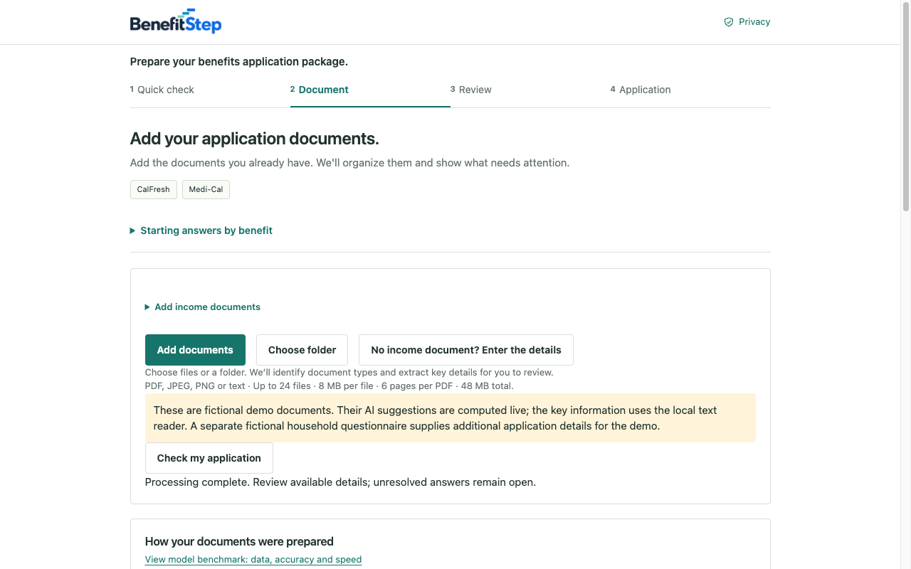
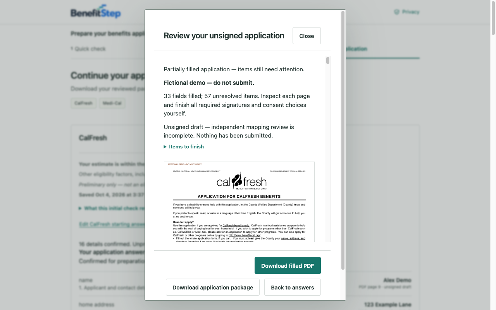

# BenefitStep

**Prepare your benefits application package.**

BenefitStep is a Chrome side-panel extension for preparing **CalFresh and Medi-Cal** applications. It helps users organize documents, review extracted information, check selected evidence issues, and download unsigned application drafts.

Documents and answers are processed locally. BenefitStep does not read the BenefitsCal website or submit an application for you.

> **Release status:** Chrome Web Store submission candidate **0.3.1** is packaged and tested locally. It has **not been submitted to or approved by the Chrome Web Store**. Independent PDF field-mapping review remains incomplete. BenefitStep is not affiliated with BenefitsCal, CDSS, DHCS, or any government agency. Initial checks are not eligibility decisions.

## What you can do

| Step | What BenefitStep does |
| --- | --- |
| **1. Quick check** | Collects initial CalFresh answers and separate Medi-Cal applicant details. Shows bounded, dated reference findings and what still needs review. |
| **2. Document** | Accepts files or a folder, suggests document types, extracts supported details, and identifies selected issues with Package Doctor. |
| **3. Review** | Lets you compare details with their sources, correct mistakes, and confirm the available information. Unknown or conflicting answers remain unresolved. |
| **4. Application** | Reuses compatible reviewed details, prepares CF285 or Medi-Cal application answers, previews unsigned PDFs, and downloads PDFs or application packages. |

The extension accepts PDF, JPEG, PNG and text files. Current import limits are **24 files**, **8 MB per file**, **6 pages per imported PDF**, and **48 MB total**. Generated official applications preserve all original pages: **18 for CF285** and **44 for CCFRM604**.

## Install and try the release

There is no Chrome Web Store installation link yet. For local testing:

1. Download [the Chrome Web Store release ZIP](releases/chrome-store-0.3.1/benefitstep-0.3.1-chrome-store.zip) and unzip it into a folder.
2. Open `chrome://extensions` in desktop Chrome **138 or later**.
3. Enable **Developer mode**, select **Load unpacked**, and choose the unzipped folder containing `manifest.json`.
4. Pin BenefitStep and click its toolbar icon to open the side panel.

If you have cloned this repository, you can instead load `releases/chrome-store-0.3.1/unpacked/` to test the store candidate, or `extension/` to test the development build.

End users do not need Python, Node.js, a developer server, or an account. Optional Chrome on-device AI availability depends on the browser and device; the bundled classifier and supported local text reader do not require that model.

## Try the fictional demo

In an empty workspace, open **Document → Try AI demo with fictional documents**.

The demo imports three bundled documents and runs the actual document classifier and local reader. A separate, clearly labeled fictional questionnaire supplies a three-person household, address, birth dates, employment and childcare details. Questionnaire values are not presented as AI-extracted facts.

Continue through **Review → Application**, then select either:

- **Generate CalFresh package (CF285)**
- **Generate Medi-Cal package (CCFRM604)**

Review the populated answers, confirm them, and generate the filled draft. You can download the PDF or a ZIP containing the PDF, application answers, generation report and items-to-finish checklist. The expanded demo fills **33 CF285 fields** and **46 Medi-Cal fields**. Fictional output is marked **DO NOT SUBMIT**.





## Privacy and permissions

- Documents and answers stay in the extension's temporary working memory; they are not uploaded to a developer server or cloud AI service.
- There is no analytics, advertising, account synchronization, or persistent private history.
- **Clear my work** removes the working state. Reloading or ending the extension page's lifetime also clears it.
- Downloaded files remain on your device until you delete them. They are ordinary, unencrypted files and may contain sensitive information.
- The extension requests only **`sidePanel`**, to display the preparation workflow. It has no host permissions or content scripts and does not read BenefitsCal or browsing history.
- Executable libraries, the classifier, fonts and PDF templates are bundled locally. Chrome may separately download its optional browser-managed on-device model.
- Official website links open only when selected; those sites have their own privacy policies.

Read the [privacy-policy page prepared for publication](store/privacy-policy.html). A public hosted URL still needs to be supplied in the Chrome Web Store dashboard. This README does not replace that policy or the dashboard's data-handling declarations.

## AI, policy engine and Package Doctor

These are separate components with different responsibilities:

| Component | Role and limits |
| --- | --- |
| **Document classifier** | A bundled trained text model suggests pay statement, invoice/receipt, other document, or unknown. It does not establish document authenticity or benefit eligibility. |
| **Information reader** | Extracts allowlisted candidate fields. Uses Chrome's on-device model when available, with a limited local text-reading fallback. Users review the proposed values. |
| **Policy engine** | Applies configured research-preview reference checks to reported facts. It does not implement full eligibility or an agency decision. CalFresh estimates are not silently reused as Medi-Cal household or income facts. |
| **Package Doctor** | Checks selected evidence problems, including duplicates, readability, amount meanings and comparable records. It does not prove completeness or agency acceptance. |
| **PDF writer** | Writes supported, confirmed answers onto original official templates. Missing items, unsupported fields, signatures and consent choices remain for manual completion. |

The classifier benchmark contains **460 training, 144 validation and 163 held-out test documents**. Results are a narrow pilot, not a benefits-wide accuracy claim; harder unfamiliar-layout fixtures expose significant limitations. See the [model card](ml/document_classifier/MODEL_CARD.md), [benchmark](ml/document_classifier/BENCHMARK.md), [data card](ml/document_classifier/DATA_CARD.md), and [dataset register](ml/dataset_register.json).

Policy configuration is in [engine/config](engine/config); source tracking is in [policy](policy). Package Doctor's research sources and rule mapping are documented in [research/package-doctor](research/package-doctor/README.md).

## Known limitations

- Initial screening is preliminary; Medi-Cal starting details do not constitute a complete financial or pathway assessment.
- Recognition and extraction depend on document quality and layout. Scans may need supported on-device AI or manual entry; broad OCR and automatic document splitting are not implemented.
- Prefill preserves meaning: individual payments are not automatically monthly household income, ambiguous people are not assigned silently, and missing name parts or addresses are not invented.
- Official PDF field coverage is partial. Independent field/branch auditing, desktop/print validation and two reviewer sign-offs remain open. Generated files are **unsigned drafts**, not validated complete applications.
- BenefitStep does not sign consent statements, submit applications, upload evidence to an agency, or mark a case approved.
- A full accessibility/security audit and wider real-user validation remain outstanding. Tests do not certify production readiness.

See [PDF implementation and remaining work](forms/README.md), [acceptance status](forms/validation/task-status.json), and [validation history](VALIDATION.md).

## Develop and test

Build prerequisites: **Node.js 22.16+**. Runtime dependencies are already bundled; `npm install` and network access are not required for a normal build.

From the repository root:

```sh
npm run build
npm test
node --test engine/tests/*.test.mjs
```

Browser checks require Python 3 and an installed desktop Chrome. Each uses a temporary isolated profile:

```sh
python3 tests/policy-ui-browser.py
python3 tests/forms-browser.py
python3 tests/demo-application-browser.py
```

The copied 0.3.0 development baseline passed **365 Node tests**. The installed-extension form suite passed **16 checks**, including offline standard fonts, previews, PDF/package downloads and source selection. The exact **0.3.1 store candidate** was separately loaded in Chrome: both original forms rendered offline with no observed remote document requests or runtime exceptions in that check.

Evidence: [Node results](forms/validation/release-tests.txt), [form browser results](forms/validation/browser-results.json), and [store-candidate browser check](releases/chrome-store-0.3.1/release-browser-check.json).

## Chrome Web Store publication

| Deliverable | Location |
| --- | --- |
| **Upload ZIP** | [benefitstep-0.3.1-chrome-store.zip](releases/chrome-store-0.3.1/benefitstep-0.3.1-chrome-store.zip) |
| **Listing assets ZIP** | [benefitstep-0.3.1-store-assets.zip](releases/chrome-store-0.3.1/benefitstep-0.3.1-store-assets.zip) |
| **Listing text and privacy declarations** | [store/LISTING.md](store/LISTING.md) |
| **Privacy-policy page** | [store/privacy-policy.html](store/privacy-policy.html) |
| **Reviewer walkthrough** | [store/REVIEWER-INSTRUCTIONS.md](store/REVIEWER-INSTRUCTIONS.md) |
| **Submission checklist** | [store/SUBMISSION-CHECKLIST.md](store/SUBMISSION-CHECKLIST.md) |
| **Package checksum** | [SHA256SUMS.txt](releases/chrome-store-0.3.1/SHA256SUMS.txt) |

Upload only the **extension upload ZIP**, whose root contains `manifest.json`. Listing images and text are entered separately in the dashboard. Do not upload the repository, training datasets or listing-assets ZIP as extension code.

Prepared visual assets include a **128×128 icon**, **440×280 promotional image**, five **1280×800 screenshots**, and an optional **1400×560 marquee image**.

Before submission, the publisher must:

1. Complete developer-account registration and two-step verification.
2. Publish the privacy-policy page at a public URL and supply publisher/support details.
3. Review the listing, permission justification and data-handling declarations for accuracy.
4. Choose distribution and regions, then submit for Chrome Web Store review. Private trusted-tester distribution is recommended initially and still requires review.

The README and ZIP are preparation materials, not evidence of store approval. See Google's [publication guide](https://developer.chrome.com/docs/webstore/publish), [asset requirements](https://developer.chrome.com/docs/webstore/images), and [local-data privacy guidance](https://developer.chrome.com/docs/webstore/program-policies/user-data-faq).

To rebuild the candidate and capture fresh images:

```sh
npm run release:chrome
npm run release:assets
```

Release packaging currently uses Python 3 and macOS `sips` for icon sizes. Asset capture requires Chrome. The packaging script assigns candidate version **0.3.1** while the development package remains **0.3.0**; update the release version before uploading a later candidate. If the source changes, rerun the checks and refresh the listing assets as well.

## Repository guide

| Directory | Contents |
| --- | --- |
| `src/`, `assets/`, `shared/` | Application UI and local processing code |
| `engine/`, `policy/`, `reference/` | Policy engine, configuration and source records |
| `forms/` | Official templates, field mappings, fixtures and validation evidence |
| `models/`, `ml/` | Shipped classifier, training code and research data |
| `vendor/` | Bundled runtime libraries, fonts and license notices |
| `demo/`, `research/`, `presentation/` | Fictional examples, research provenance and presentation material |
| `tests/`, `scripts/` | Automated checks, build and packaging tools |
| `extension/` | Generated development extension |
| `store/`, `releases/` | Publication materials and store candidate |

Additional examples: [video household](demo/video-household/README.md), [harder document challenge](demo/challenge-v1/README.md), [training-data demo](demo/training-data-demo/README.md), and [separate classifier experiment](ml/document_classifier_v0_2/README.md). Training examples are not additional held-out test evidence.

## Feedback and license

Use [GitHub Issues](https://github.com/aiscihub/benefitstep/issues) for reproducible bugs and suggestions. Use fictional examples; do not post personal benefits documents or private application details in public issues.

BenefitStep's project code is provided under the [MIT License](LICENSE). Bundled dependencies, fonts, agency forms and datasets retain their respective terms; the project license does not relicense those materials. See [SBOM.json](SBOM.json), [dependency notices](vendor), and [data provenance](ml/document_classifier/DATA_CARD.md).
