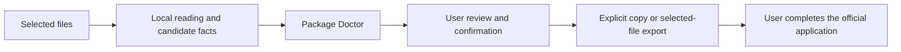

# BenefitStep — presentation draft v0.1

**Format:** 17 slides · approximately 13–15 minutes, including a short demonstration  
**Audience:** A general audience with technical reviewers  
**Companion:** [Speaker wording and demo cues](BenefitStep_Speaker_Notes_v0_1.md)

---

## 1. BenefitStep

### Simpler applications. Checked details. Private by design.

Turn available documents into information you can review and use beside the official application.

**A browser companion for benefits preparation, applying, and follow-up.**

---

## 2. Having the document is only the beginning

An applicant still has to work out:

- Which information answers this question?
- Which amount and period does it describe?
- What needs correction or explanation?
- What has actually been sent—and what happens next?

**Example: A bill shows $940 due. Only $140 belongs to the current billing period.**

---

## 3. Four parts, one experience

| Part | What it does for the applicant |
|---|---|
| **Guided workflow** | Keeps the next action clear. |
| **Benefits Document AI** | Suggests broad types and prepares source-linked candidate facts through a separate reader. |
| **Package Doctor** | Checks relationships and shows what needs attention. |
| **On-device privacy** | Keeps document processing local and sharing under user control. |

**Add documents once. Review the important details. Continue with the application.**

---

## 4. Start with an early answer, then prepare

**Quick check → Add documents → Resolve important issues → Confirm once → Apply and follow up**

- Four screening questions per program, including an income range.
- Results update when answers change; skipping remains available.
- Add a folder or multiple files without sorting them first.
- Confirm the resolved summary with **“Yes, correct.”**

**A preliminary result guides the next step. It does not decide eligibility.**

---

## 5. Residence first; proof depends on the program

**Current quick check:** Clarify a recent move, no fixed address, temporary absence or residence in another state before suggesting a next step. Starting the check requires no documents.

| Program | Residency evidence guidance |
|---|---|
| CalFresh | Generally verified; existing evidence or someone who can confirm residence may suffice. No single document type is mandatory; exceptions apply when verification cannot reasonably be accomplished. |
| Medi-Cal | DHCS applicant guidance says to certify California residence and provide a living/mailing address; routine residency documents are not required. |

**Planned evidence guidance:** Reuse relevant sources; ask about conflicting addresses; show actual county requests. A missing lease should not become an automatic rejection.

*Quick-check routing is implemented. Automatic address extraction and residency-specific Doctor checks are not implemented.*

[CalFresh verification: §273.2(f)(1)(vi)](https://www.ecfr.gov/current/title-7/section-273.2) · [DHCS address guidance](https://www.dhcs.ca.gov/medi-cal/help/)

---

## 6. Read the document—and preserve what its numbers mean

**Document → Type → Candidate facts → Source comparison**

For a pay statement, keep these separate:

| Field | Fictional example |
|---|---:|
| Current gross pay | $2,550 |
| Current take-home pay | $2,060 |
| Year-to-date gross pay | $22,950 |

Every extracted fact retains its source page. Missing information stays unknown.

**Current implementation:** A trained, experimental text classifier runs during import and suggests three broad document types. Field extraction separately uses an on-device AI adapter or labeled local text reader; hardware-native extraction evaluation is still pending.

**Classifier pilot:** 163 held-out documents → 126 correct suggestions, 37 unknowns. Public data; limited categories and source diversity.

**Unfamiliar layouts remain a gap:** A later 12-case development challenge produced 0 correct suggestions, 11 unknowns and 1 wrong suggestion. The following slides show the broader coverage plan and candidate evaluation.

---

## 7. Cover the documents people actually bring

**26 document families mapped for development**

| Evidence area | Examples |
|---|---|
| Income | Paystubs, employer letters, tax returns, business records, benefit awards |
| Housing | Rent and leases, mortgage, utility bills |
| Care and expenses | Dependent care, support payments, medical bills |
| Identity and household | IDs, birth certificates, student records |
| Health coverage | Insurance cards and coverage records |
| Agency follow-up | Requests, decision notices, application and upload receipts |

**Today:** Three broad trained labels; 13 named extraction schemas plus unknown. Schema support is not validated recognition accuracy.

**Gap:** 87 of 132 Doctor scenarios include paystubs. Broader document coverage needs separate data and evaluation.

*The 26 families are a planning map, not 26 trained classes or a mandatory upload checklist.*

[Coverage, missing capabilities and proposed challenges](../research/package-doctor/DOCUMENT_COVERAGE.md)

---

## 8. More realistic data exposed the model’s limits

**New corpus:** 144 fictional documents across 36 authored families, each with PDF text and actual scan OCR → 288 paired captures.

| Candidate partition | Model rows | Unique documents |
|---|---:|---:|
| Training: public + new synthetic | 652 | 556 |
| Validation: public + new synthetic | 192 | 168 |
| New synthetic test | 48 | 24 |

| Same 48 test captures | Correct suggestions | Unknown | Wrong suggestions |
|---|---:|---:|---:|
| Shipped v0.1 | 0 | 48 | 0 |
| Experimental v0.2 | 14 | 34 | 0 |

**v0.2 failed its validation release criteria and is not deployed.** All 16 pay-record test captures remained unknown. Accepted suggestions were invoices/receipts.

The corpus improves test realism; shared generation components still limit independence. Training OCR is a separate macOS tool, not a new extension OCR feature.

[Dataset, model results and limits](../ml/document_classifier_v0_2/README.md) · [Detailed benchmark slides](BenefitStep_Model_Benchmark.md)

---

## 9. Package Doctor checks the relationship

### Is a previous balance being used as a current charge?

| | Bill A | Bill B |
|---|---:|---:|
| Current charges | $140 | $940 |
| Previous balance | $800 | $0 |
| Total due | $940 | $940 |
| Prepared current-charge answer | $940 | $940 |
| Check result | **Compare and correct** | **No prior-balance issue found** |

**Same total due. Different evidence. Different result.**

The finding includes the source amounts, the problem, and a next action. Only the affected answer pauses.

*Fictional paired test. Bill A’s prepared answer is deliberately changed to demonstrate the check.*

**Research trail:** [Sources, implemented checks and evidence gaps](BenefitStep_Package_Doctor_Research.md). Public problem reports, published service research and official guidance are recorded separately.

---

## 10. Where Package Doctor’s checks come from

**13 external sources reviewed in a bounded desk review**

| Source type | Count | Contribution |
|---|---:|---|
| Public applicant questions and complaints | 5 | Identify confusing situations |
| Published Code for America research | 3 | Document service and verification barriers |
| Official benefits guidance | 4 | Bound responses by program, stage and jurisdiction |
| Utility-provider sample statement | 1 | Explain the amounts and fields on a bill |

**Reported difficulty → source review → defined check → positive and negative tests**

Seven sources were already registered; six were collected in the later review. Four additional product-feedback themes came from this development conversation.

*Desk research, not our own applicant survey. One public report is from Arizona and is used only for general income confusion. Each source’s scope and connection are recorded; some checks are engineering safeguards.*

[Source register and rule mapping](../research/package-doctor/README.md) · [Example published verification research](https://codeforamerica.org/news/overcoming-barriers-how-getcalfresh-helps-applicants-submit-verifications/)

---

## 11. What Package Doctor checks today

**9 implemented check categories**

| ID | Issue or condition checked |
|---|---|
| PD01 | Unreadable or unresolved information |
| PD03 | Exact duplicate files |
| PD04 | Wrong income amount basis |
| PD05 | Evidence period does not match the request |
| PD06 | Person, program or application does not match |
| PD07 | Comparable pay records disagree |
| PD08 | Previous balance used as current charges |
| PD12 | County request still needs a response |
| PD24 | Document type unresolved |

Two additional workflow safeguards prevent using stale confirmed information and confusing an upload receipt with an application receipt.

**24 patterns in the catalog = 9 Doctor checks + 2 related workflow safeguards + 13 design/future patterns.**

These checks can report an issue, request context, or exclude a duplicate. They do not decide eligibility, authenticity or county acceptance.

---

## 12. The same record can fit one request and miss another

### Evidence: income earned September 1–30

| Confirmed request | Result |
|---|---|
| Income earned October 1–31 | **Period mismatch** |
| Income earned September 1–30 | **Dates covered** |
| Person or date meaning unclear | **More context needed** |

Match the **application, program, person, period, and date meaning**.

**Dates covered does not mean accepted by the county.**

---

## 13. Privacy is part of the workflow

- Session memory by default.
- No cloud document fallback or personal-data analytics.
- No page-reading permissions or automatic form submission.
- The applicant chooses what to share.

**Processed on your device. You choose what to share.**

---

## 14. Demo: from a bill to a usable answer

1. Choose **Try AI demo with fictional documents** on Add documents.
2. Show the AI type suggestion, then compare the bill's current charges with the prepared answer.
3. Resolve the Package Doctor finding.
4. Confirm the available details once.
5. Use the matching information beside BenefitsCal.
6. Export a review PDF with a clickable index and selected originals.

**Prepared → Submitted → County response**

These are separate states. The applicant records what actually happened.

---

## 15. What we have tested

| Evaluation | Recorded result | What it measures |
|---|---|---|
| Full automated suite | 202 passed in the recorded run | Tested application/reference behavior |
| Existing Doctor/state subset | 46 passed on recheck | Subset of the full suite |
| New AI-authored scenarios | 132 executed: **129 passed, 3 failed** | Synthetic logic after extraction |
| Future rule scenarios | 26 not implemented or executed | Design backlog |
| Installed Chrome workflow | Import, correction, confirmation, follow-up and export exercised | Recorded browser flow |

**Three unresolved failures:** orphaned duplicate after original deletion; uncertain pay treated as a definite conflict; altered-state receipt from another application closing a request.

The third is a defensive-state probe, not an observed normal UI path. No remote HTTP(S) page requests were observed in the recorded instrumented flow; tested browser storage remained empty.

**These results do not measure document-classifier accuracy, a security audit, or applicant outcomes.**

[Full scenario list and results](../research/package-doctor/SCENARIO_ASSESSMENT.md) · [Browser validation](../VALIDATION.md)

---

## 16. What we need to prove next

| Question | Next evaluation |
|---|---|
| Can local AI handle unfamiliar documents? | Address the failed candidate release criteria; evaluate unfamiliar document families, source-supported fields and abstention. |
| Do Doctor safeguards handle edge cases? | Resolve the three scenario failures; review expected outcomes independently and test additional unfamiliar cases. |
| Does this reduce applicant effort? | Observe fictional tasks; measure completion time, corrections, and understanding of the next action. |
| Can saved work be protected? | Independently review and test encrypted persistence before enabling it. |
| Can evidence requests be more specific? | Add reviewed residency guidance and relevant-document matching; keep unsupported address comparisons and other policy checks marked as future work. |

**Working today:** Core preparation, generic evidence checks, manual application help, and separate follow-up.

---

## 17. Make the next step easier

### Help people understand their evidence, correct important details, and continue with control.

**Less retyping. Clearer issues. Source-linked answers. Deliberate sharing.**

**BenefitStep**  
Simpler applications. Checked details. Private by design.

---

## Supporting material — not an additional slide

- [Speaker wording and presentation cues](BenefitStep_Speaker_Notes_v0_1.md)
- [Package Doctor research detail and source examples](BenefitStep_Package_Doctor_Research.md)
- [Model benchmark and candidate evaluation](BenefitStep_Model_Benchmark.md)
- [Document-family coverage and gaps](../research/package-doctor/DOCUMENT_COVERAGE.md)
- [Expanded Doctor scenario results](../research/package-doctor/SCENARIO_ASSESSMENT.md)
- [Presentation evidence data: sources, checks and test counts](BenefitStep_Presentation_Evidence.json)
- [Rule-by-rule provenance](../research/package-doctor/README.md)
- [Implementation overview](../README.md)
- [Executed validation and remaining work](../VALIDATION.md)
- [Fictional PDF demo walkthrough](../demo/package-doctor/DEMO.md)
- [Current sidebar screenshot](../tests/sidebar.png)

All monetary examples in this presentation are fictional test data. The deck does not claim measured time savings, eligibility decisions, benefits-wide model accuracy, or production security certification.
